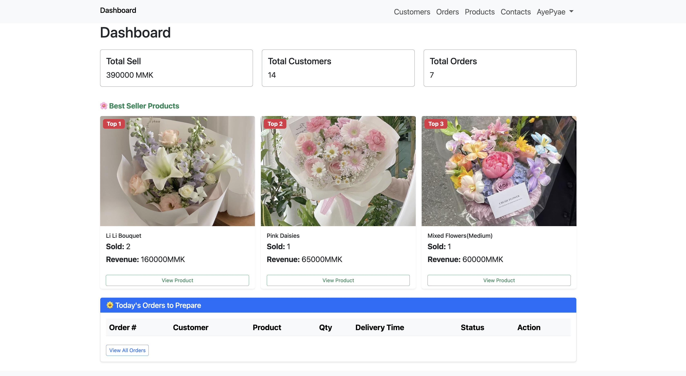
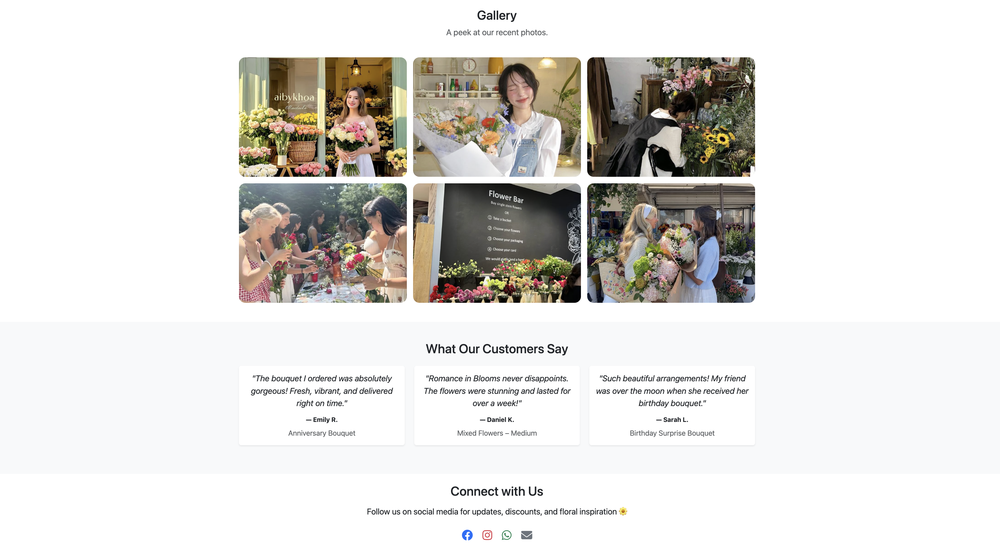

# Romance in Blooms - E-Commerce Website

Welcome to **Romance in Blooms**, a simple flower shop e-commerce platform built with PHP and MySQL. This project allows customers to browse products, add items to their cart, checkout with delivery details, and upload payment screenshots. Admins can manage products, orders, customers, and view sales statistics.

---

## Features

- **Product Catalog:** Browse available products with images, descriptions, and stock status.
- **Shopping Cart:** Add products to cart, update quantities, and remove items.
- **Checkout:** Enter billing and delivery details, select delivery date & time, and upload payment screenshot.
- **Order Management:** Admin dashboard to view, update, and manage orders and customers.
- **Best Sellers:** View top-selling products.
- **Admin Panel:** Manage products, orders, customers, and profile.

---
## Screenshots

Below are some screenshots of the website:

- **Dashboard Page:**  
  

- **Home Page:**  
  

- **Shop Page:**  
  

Replace the image paths above with your actual screenshot file locations.

These images showcase the main features and design of the Romance in Blooms e-commerce platform.

---

## Folder Structure

- `/admin` - Admin dashboard and management pages
- `/uploads` - Uploaded payment screenshots
- `/templates` - Common UI components (header, footer, navbar)
- `/inc` - Helper functions, arrays, and language files
- `/assets` - CSS, JS, images, and fonts
- `/index.php` - Main shop page
- `/product.php` - Product details page
- `/cart.php` - Shopping cart and checkout
- `/search.php` - Product search

---

## Installation

1. **Clone or Download** this repository.
2. **Import the Database:**  
   - Create a MySQL database and import the provided SQL file (if available).
3. **Configure Database Connection:**  
   - Edit `/admin/connect.php` with your database credentials.
4. **Set Permissions:**  
   - Ensure the `/uploads` folder is writable for file uploads.
5. **Run Locally:**  
   - Place the project in your XAMPP `htdocs` folder.
   - Start Apache and MySQL from XAMPP.
   - Visit `http://localhost/E-Commerce-main/` in your browser.

---

## Usage

- **Customers:**  
  - Browse products, add to cart, checkout, and upload payment screenshot.
- **Admins:**  
  - Login via `/admin/index.php`
  - Manage products, orders, customers, and view dashboard statistics.

---

## Technologies Used

- PHP (Vanilla)
- MySQL (PDO)
- Bootstrap (Frontend)
- FontAwesome (Icons)
- Parsedown (Markdown parsing for product descriptions)

---

## Customization

- Update language files in `/inc/languages/` for localization.
- Modify styles in `/admin/assets/css/main.css`.
- Add or edit products via the admin dashboard.

---

## License

This project is for educational purposes.  
Feel free to modify and use as needed.

---

## Credits

Developed by [Aye Pyae Wai Khin Soe].  
Icons by [FontAwesome](https://fontawesome.com/).  
Images and content are for demo purposes only.
